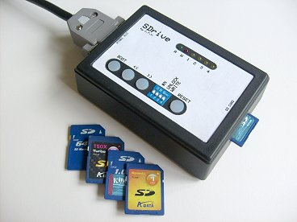
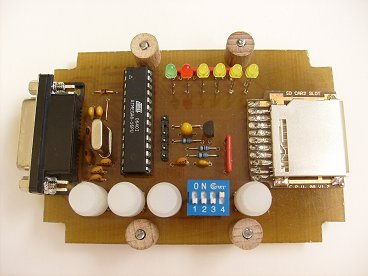
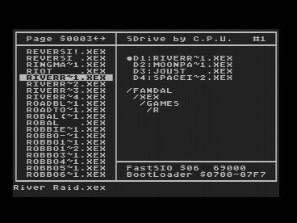

# SDrive

**SDrive by C.P.U.** (2008-2009) , Robert Petružela (Bob!k) & Radek Štěrba (Raster)

**SDrive** (rev.12.10.2008) (control program v01 20090403)

Robert Petružela a Radek Štěrba , Bob!k & Raster , C.P.U. , 2008-2009  
The SDrive is a device that connects to Atari XL/XE's serial (SIO) port and simulates an Atari floppy disk drive with full read/write access to programs and data stored on a SecureDigital flash card (SD).

### Main features:

*   Supported flash cards: SecureDigital up to 2GB size, FAT16 filesystem
*   Maximum number of drives: 4 (D1: to D4:) + 1 special boot drive
*   Supported SIO transfer rates: 3.5 to 128kb/s (standard 19 and 69kb/s)
*   Supported disk images: ATR, XFD, size up to 16MB, 128 or 256B sectors
*   Supported executable files: COM, XEX, BIN.... (any filename extension)
*   Device controlled by software running on Atari from the SD card, which can be therefore easily updated/replaced
*   Drives swappable on the fly by buttons
*   Write protect/enable switch
*   SDrive ID number selection switch - simultaneous use of up to 4 SDrives
*   Low cost design – no LCD, a few LEDs, cheap DIL28 Atmega8 MCU, single sided PCB
*   Firmware and software sourcecode freely available

### Special features:

*   Buffered reads for speedup
*   Delayed writes for speedup and greatly reduced flash write cycles
*   Built-in bootloader requiring less than 256 bytes including sector buffer, relocatable in the $0500-$05F7 to $BE00-$BEF7 range, with SKCTL initialization before every block. Supports executable files of up to 8MB size.
*   Directory with filename simulated for active files in drives, data handled through standard 128B sectors. Executable files can be run from most DOSes or Q-MEG. Random data files with arbitrary suffix can be activated and opened by a program through DOS or copied to disk images. (Note: 80KB file size limit applies to standard DOSes, 8MB to Q-MEG and MyDOS)

### How it works:

After inserting the SD card the device looks for the SDRIVE.ATR file in the root directory and loads it in the special boot drive which is then made available as D1:. Your Atari then boots the control program from the D1: drive. The software offers, among other functions, mounting ATR and XFD floppy images or COM, XEX, BIN.. executables in the D1: ... D4: drives. Then Atari boots from the first drive. SDrive's buttons can be used to swap the contents of the D1: drive with that of the others, which allows the user to comfortably operate even multidisk games (up to 4 disks) by assigning the floppy images to the drives and swapping them with the D1: (called “system drive” from now on) when needed.

System drive number is derived from SDrive ID number, so for SDrive #1 - #4 there is system drive D1: - D4:.

Note: While booting the SDRIVE.ATR you can choose between loading the SDRIVE.COM control program (default), SDRIVEN.COM („NoAutoload“ version), SDRIVENH.COM („NoAutoload“ + built-in help), DOS II+ or S/XEGS RAMcart feeder of control program (SDRIVENH.COM) by holding Atari Shift and pressing keys 1 to 5.

**Disk image file with Atari control program (place it to root directory of SD card):**

*   [SDRIVE.ATR](SDRIVE.ATR) (control program v01 20090403)

**Detailed descriptions:**

*   [SDrive_en.pdf](SDrive_en.pdf) (control program v01 20090403)
*   [SDrive_siocommands.pdf](SDrive_siocommands.pdf)

**Changes and complete documentation package:**

*   [SDrive_changes.txt](SDrive_changes.txt)
*   [SDrive20090403.zip](SDrive20090403.zip) (DOCS, HW, SW, SRC) (0.5 MB)

